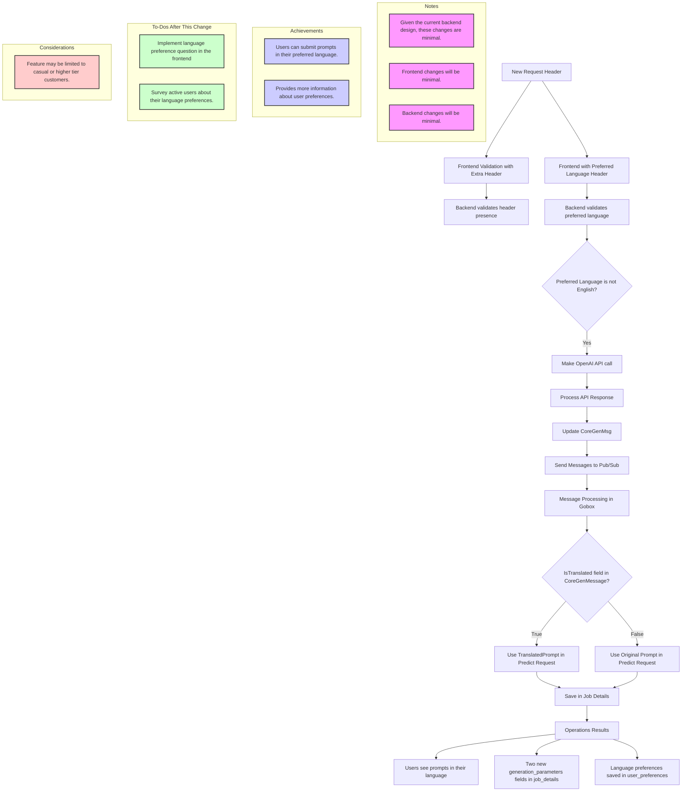

```mermaid
graph TD
    A[New Request Header] --> B[Frontend Validation with Extra Header]
    A --> C[Frontend with Preferred Language Header]
    B --> D[Backend validates header presence]
    C --> E[Backend validates preferred language]
    
    E --> F{Preferred Language is not English?}
    F -->|Yes| G[Make OpenAI API call]
    G --> H[Process API Response]
    H --> I[Update CoreGenMsg]
    I --> J[Send Messages to Pub/Sub]
    
    J --> K[Message Processing in Gobox]
    K --> L{IsTranslated field in CoreGenMessage?}
    L -->|True| M[Use TranslatedPrompt in Predict Request]
    L -->|False| N[Use Original Prompt in Predict Request]
    
    M --> O[Save in Job Details]
    N --> O[Save in Job Details]
    
    O --> P[Operations Results]
    P --> Q[Users see prompts in their language]
    P --> R[Two new generation_parameters fields in job_details]
    P --> S[Language preferences saved in user_preferences]
    
    subgraph Notes
        T[Given the current backend design, these changes are minimal.]
        U[Frontend changes will be minimal.]
        V[Backend changes will be minimal.]
    end
    
    subgraph Achievements
        W[Users can submit prompts in their preferred language.]
        X[Provides more information about user preferences.]
    end
    
    subgraph To-Dos After This Change
        Y[Implement language preference question in the frontend]
        Z[Survey active users about their language preferences.]
    end
    
    subgraph Considerations
        AA[Feature may be limited to casual or higher tier customers.]
    end
    
    classDef note fill:#f9f,stroke:#333,stroke-width:2px;
    class T,U,V note;
    
    classDef achieve fill:#ccf,stroke:#333,stroke-width:2px;
    class W,X achieve;
    
    classDef todo fill:#cfc,stroke:#333,stroke-width:2px;
    class Y,Z todo;
    
    classDef consid fill:#fcc,stroke:#333,stroke-width:2px;
    class AA consid;
```
