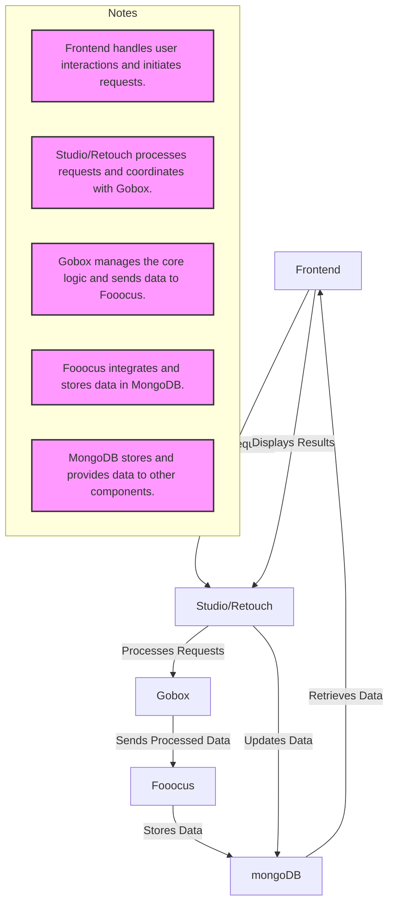

```mermaid
graph TD
    A[Frontend] -->|Sends Requests| B[Studio/Retouch]
    B -->|Processes Requests| C[Gobox]
    C -->|Sends Processed Data| D[Fooocus]
    D -->|Stores Data| E[mongoDB]
    E -->|Retrieves Data| A
    A -->|Displays Results| B
    B -->|Updates Data| E

    subgraph Notes
        F[Frontend handles user interactions and initiates requests.]
        G[Studio/Retouch processes requests and coordinates with Gobox.]
        H[Gobox manages the core logic and sends data to Fooocus.]
        I[Fooocus integrates and stores data in MongoDB.]
        J[MongoDB stores and provides data to other components.]
    end

    classDef note fill:#f9f,stroke:#333,stroke-width:2px;
    class F,G,H,I,J note;

```
